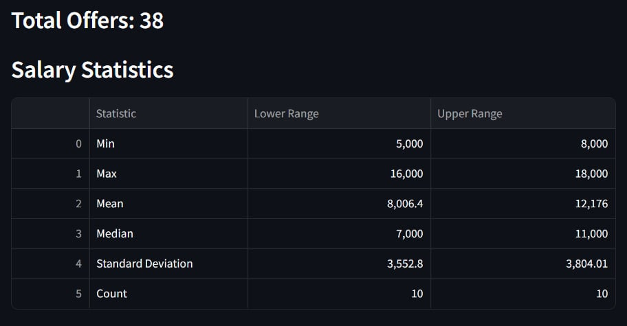

# Projekt - analiza ofert pracy

Projekt skupia się na analizie ofert pracy. Został zrealizowany za pomocą paradygmatów programowania funkcyjnego oraz obiektowego, wykorzystanych kolejno do `web scrapingu` oraz utworzenia UI wyświetlającego wyniki krótkiej analizy.

- web scraping: `selenium`

- UI: `streamlit`

- unit testing: `unittest`

## Wymagania

1. Biblioteki:

- `pandas`

- `streamlit`

- `altair`

- `selenium`

- `webdriver_manager`

2. Aktywacja środowiska dla projektu: `source ./venv/bin/activate`
3. Uruchomienie aplikacji w przeglądarce: `streamlit run main.py`

---
## Strona startowa

## Wyniki analizy - wynagrodzenia

## Wyniki analizy - wymagania - tabela

## Wyniki analizy - wymagania - wykresy

